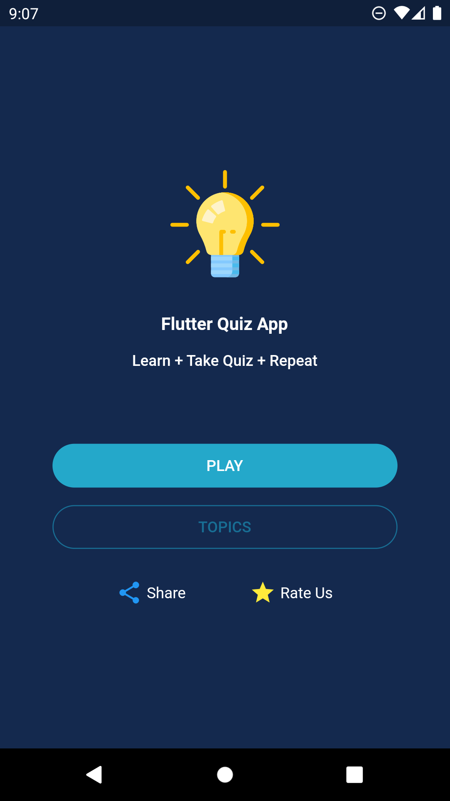
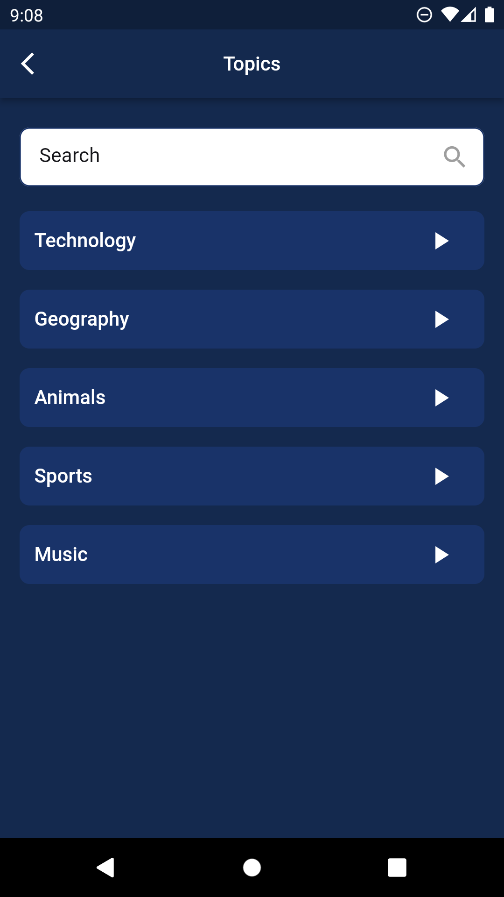
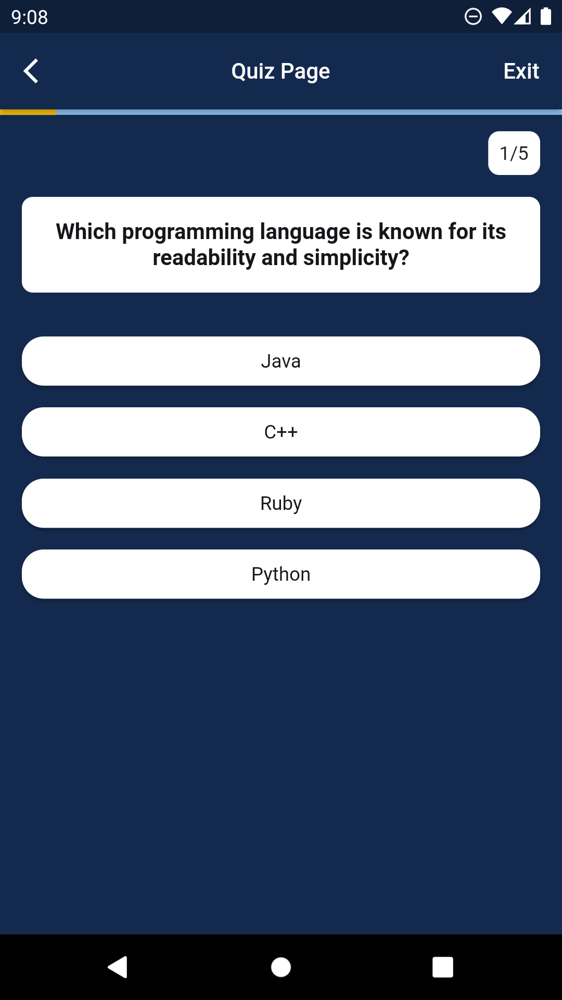
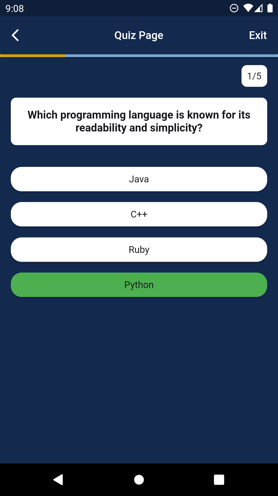
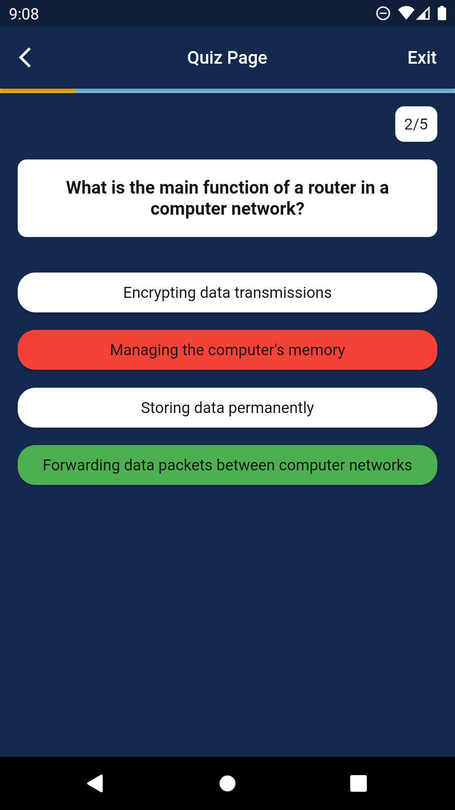

# Quiz App

## Deskripsi
Quiz App adalah aplikasi kuis yang dibangun dengan flutter framework. Dalam pengembangannya, aplikasi ini menerapkan konsep clean architecture dan menggunakan pendekatan struktur folder DDD (Domain-Driven Design), serta menggunakan state management  Bloc.

### Requirement:
* Flutter Version: 3.10.5

### Instalasi:
* Clone repositori ini ke dalam direktori lokal Anda.
* jalankan perintah berikut untuk menjalankan aplikasi
 1. "flutter pub get"
 2. "flutter run"

 ### Fitur:
* Splash Screen

* Home Page

* Topic Page

* Search Topic Page

* Quiz Page

* Result Page

* Random Question Quiz

* Play Quiz by Topic

* Share App & Share Score Quiz

* Rate App

### Packages & Libraries:
* cloud_firestore: Digunakan untuk berinteraksi dengan Firebase Firestore Database.

* flutter_bloc: Digunakan untuk state management menggunakan Bloc pattern.

* dartz: Digunakan untuk functional programming.

* firebase_core: Digunakan untuk konfigurasi Firebase.

* freezed: Digunakan untuk generated code dan immutable value.

* get_it: Digunakan untuk dependency injection.

* go_router: Digunakan untuk routing di aplikasi.

* injectable: Digunakan untuk dependency injection.

* intl: Digunakan untuk internationalization dan localization.

* shimmer: Digunakan untuk efek loading shimmer.

* share_plus: Digunakan untuk fiture Share pada aplikasi.

* url_launcher: untuk Membuka URL dalam browser perangkat atau aplikasi eksternal.

* cached_network_image: untuk Memuat dan menyimpan sementara gambar dari URL dengan efisiensi cache.

              
